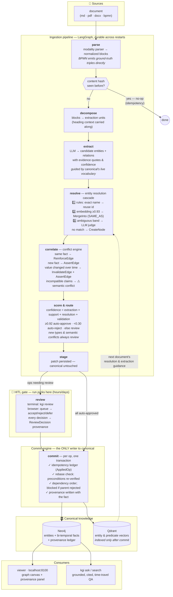
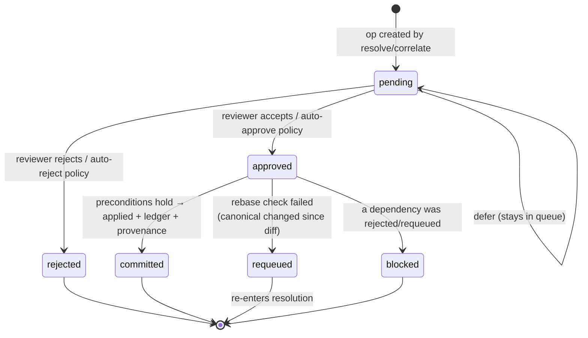
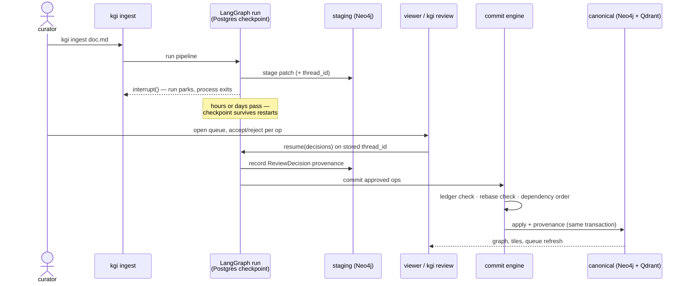
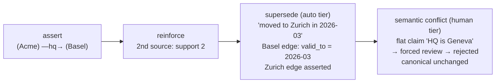
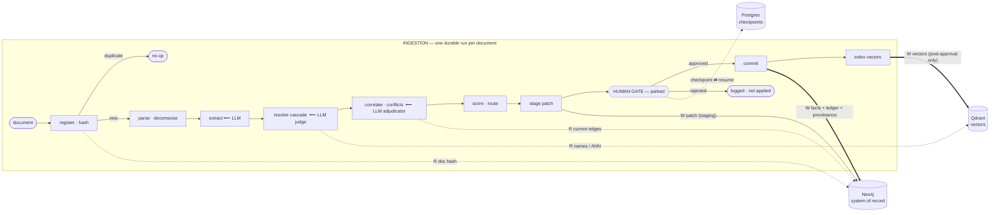
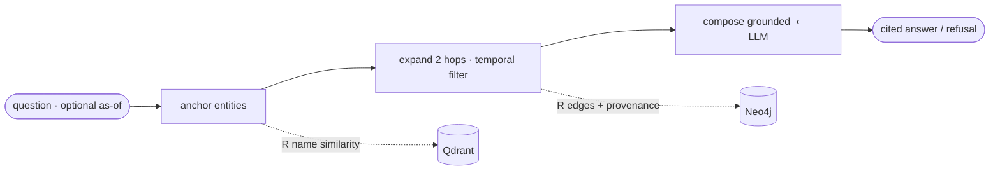

# kgi — Application Lifecycle

How a document becomes trusted, queryable knowledge — and why nothing skips the gate.

## The one invariant

> **The canonical graph is only ever mutated by an approved commit.** All inference
> lands in a staging layer; the human review gate is the promotion boundary between
> staging and canonical. Everything else in the system exists to serve this rule.

A consequence worth internalizing: extraction can be wrong, resolution can be wrong,
the conflict adjudicator can be wrong — and none of it matters until a human (or an
explicit auto-approval policy) admits the result. Mistakes are cheap in staging and
reviewable at the boundary.

## Overall lifecycle

Two feedback loops are drawn dashed: committed entities/predicates become the
vector index and vocabulary that guide the *next* document's extraction and
resolution — the graph gets better at absorbing documents as it grows.

## Life of a single proposed fact (patch op)

Everything downstream of resolution is a **patch**: a set of typed operations
(`CreateNode`, `MergeInto`, `AssertEdge`, `InvalidateEdge`, …) forming a dependency
DAG. Ops are routed and decided individually, but an op can only commit when its
whole dependency closure is approved — approving an edge whose endpoint was
rejected silently blocks the edge instead of corrupting the graph.

The **rebase check** is what makes pending patches safe to leave parked for days:
each op carries preconditions snapshotting the canonical state it was diffed
against (`node_exists`, `edge_absent`, …). At commit time they are re-verified
inside the same transaction as the write; a mismatch re-queues the op instead of
applying it blind.

## The review interaction (durable across processes)

## Bi-temporal facts: how knowledge changes without losing history

Facts carry a validity window (`valid_from` → `valid_to`). Nothing is deleted;
change is expressed by closing windows.

The conflict adjudicator is deliberately conservative: without clear evidence of
change over time it escalates to a human rather than auto-superseding — a wrong
supersession silently rewrites history; an escalation costs one review.

Retrieval honors the windows: `kgi ask "Where is Acme headquartered?"` answers
Zurich; add `--as-of 2024-06-01` and the same graph answers Basel, cited to the
closed edge and its source documents.

## Who writes what, where

| Store | Contents | Written by |
|---|---|---|
| **Neo4j** | `:Canonical` entities, `:REL` bi-temporal facts | commit engine only |
| | `:Alias`—`SAME_AS`→ (reversible merges) | commit engine only |
| | `:AppliedOp` ledger, `:Document` hashes, `:ReviewDecision` | commit engine / review node |
| | `:Patch` staged patches (audit trail, never deleted) | stage node |
| **Qdrant** | entity + predicate embeddings | commit node, post-approval only |
| **Postgres** | LangGraph checkpoints (parked runs) | LangGraph runtime |

The separation is the security model in miniature: staged knowledge exists only as
`:Patch` documents and is invisible to retrieval and the vector index; a fact that
never passes review never influences anything.

## Where each stage lives

| Stage | Module | Command surface |
|---|---|---|
| parse / decompose | `kgi/ingestion`, `kgi/decomposition` | `kgi ingest` |
| extract | `kgi/extraction` | — |
| resolve | `kgi/resolution` (cascade) | — |
| correlate | `kgi/conflict` (adjudicator) | — |
| score / route | `kgi/confidence`, `kgi/routing` | thresholds in `.env` |
| stage / review | `kgi/pipeline/graph.py` (interrupt) | `kgi pending` / `kgi review`, viewer queue |
| commit | `kgi/commit/engine.py` | — |
| retrieve | `kgi/retrieval` | `kgi search` / `kgi ask` |
| showcase | `kgi/viewer` | `kgi serve` → localhost:8100 |

## All flows: ingestion and query (source for the architecture deck figures)

