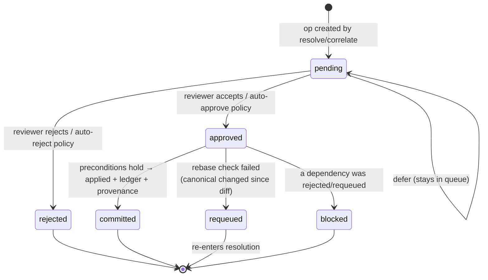
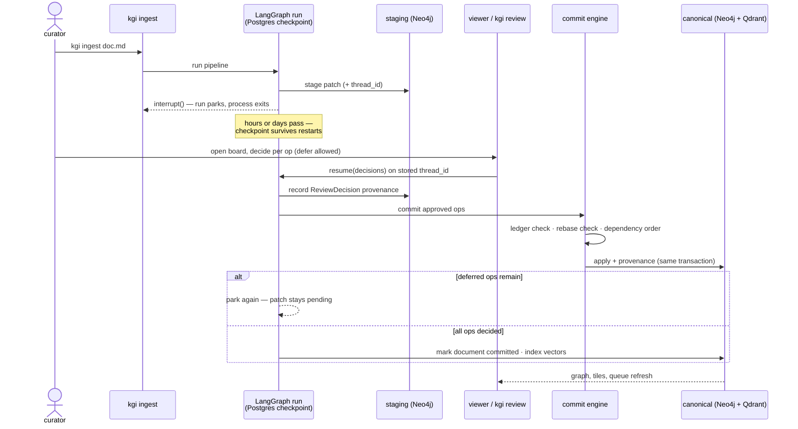
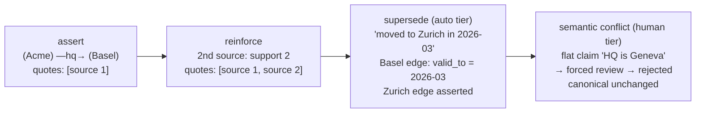
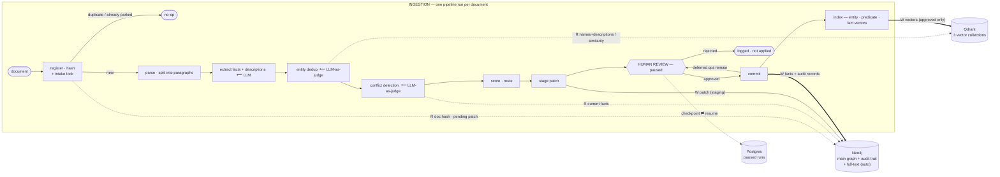
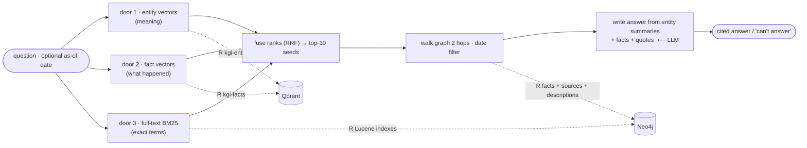
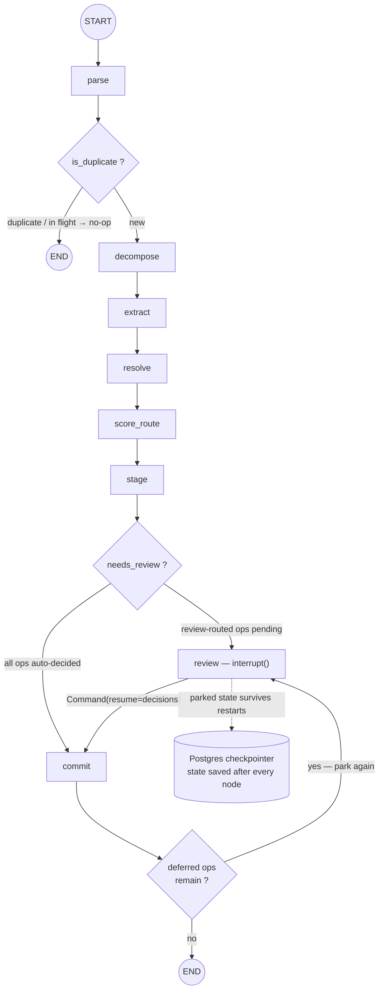

# kgi — Application Lifecycle

How a document becomes trusted, queryable knowledge — and why nothing skips the gate.

## The one invariant

> **The canonical graph is only ever mutated by an approved commit.** All inference
> lands in a staging layer; the human review gate is the promotion boundary between
> staging and canonical. Everything else in the system exists to serve this rule.

A consequence worth internalizing: extraction can be wrong, resolution can be wrong,
the conflict adjudicator can be wrong — and none of it matters until a human (or an
explicit auto-approval policy) admits the result. Mistakes are cheap in staging and
reviewable at the boundary.

## Overall lifecycle

```mermaid
flowchart TB
    subgraph sources["📄 Sources"]
        DOC["document<br/>(md · pdf · docx · bpmn)"]
    end

    subgraph pipeline["Ingestion pipeline — LangGraph, durable across restarts"]
        direction TB
        PARSE["<b>parse</b><br/>modality parser → normalized blocks<br/><i>BPMN emits ground-truth triples directly</i>"]
        DUP{{"content hash committed,<br/>or already parked at the gate?"}}
        DECOMP["<b>decompose</b><br/>blocks → extraction units<br/>(heading context carried along)"]
        EXTRACT["<b>extract</b><br/>LLM → candidate entities + relations<br/>each entity with a one-line description,<br/>each relation with a verbatim quote<br/><i>guided by canonical's live vocabulary</i>"]
        RESOLVE["<b>resolve</b> — entity resolution cascade<br/>1️⃣ rules: exact name → reuse id<br/>2️⃣ embed name+description, ≥0.90 → MergeInto (SAME_AS)<br/>3️⃣ ambiguous band 0.60–0.90 → LLM judge<br/>no match → CreateNode (+ name_absent assumption)<br/>known entity, new info → UpdateNodeProps<br/><i>(gap-fill; descriptions merge, never overwrite)</i>"]
        CORRELATE["<b>correlate</b> — conflict engine<br/>same fact → ReinforceEdge (+ the new source's quote)<br/>new fact → AssertEdge<br/>value changed over time → InvalidateEdge + AssertEdge<br/>incompatible claims → ⚠️ semantic conflict"]
        SCORE["<b>score & route</b><br/>confidence = extraction + support + resolution + validation<br/>≥0.92 auto-approve · <0.30 auto-reject · else review<br/><i>new types & semantic conflicts always review</i>"]
        STAGE["<b>stage</b><br/>patch persisted — canonical untouched"]
    end

    subgraph gate["🚧 HITL gate — run parks here (hours/days)"]
        REVIEW["<b>review</b><br/>terminal: kgi review<br/>browser: board → accept/reject/defer,<br/>grouped by entity, batch actions<br/>every decision → ReviewDecision provenance"]
    end

    subgraph commit["Commit engine — the ONLY writer to canonical"]
        APPLY["<b>commit</b> — per op, one transaction<br/>✓ idempotency ledger (AppliedOp)<br/>✓ rebase check: preconditions re-verified<br/>&nbsp;&nbsp;&nbsp;(incl. name_absent on creates)<br/>✓ dependency order; blocked if parent rejected<br/>✓ provenance written with the fact"]
    end

    subgraph canonical["🏛 Canonical knowledge"]
        GRAPH[("Neo4j<br/>entities (+descriptions) · bi-temporal facts<br/>(+accumulated quotes) · provenance ledger<br/>+ Lucene full-text, auto-maintained")]
        VEC[("Qdrant — three collections<br/>entity (name+description) · predicate ·<br/>fact (rendering+window+quotes)<br/><i>indexed only after commit</i>")]
    end

    subgraph consumers["Consumers"]
        VIEWER["viewer · localhost:8100<br/>graph canvas + provenance panel"]
        ASK["kgi ask / search<br/>three retrieval doors fused by RRF<br/>grounded, cited, time-travel QA"]
    end

    DOC --> PARSE --> DUP
    DUP -- "yes — no-op<br/>(idempotency / intake lock)" --> DONE(("done"))
    DUP -- no --> DECOMP --> EXTRACT --> RESOLVE --> CORRELATE --> SCORE --> STAGE
    STAGE -- "ops needing review" --> REVIEW --> APPLY
    STAGE -- "all auto-approved" --> APPLY
    APPLY -- "deferred ops remain —<br/>park again" --> REVIEW
    APPLY --> GRAPH
    APPLY --> VEC
    GRAPH --> VIEWER & ASK
    VEC -. "next document's<br/>resolution & extraction guidance" .-> RESOLVE
```

Two feedback loops are drawn dashed: committed entities/predicates become the
vector index and vocabulary that guide the *next* document's extraction and
resolution — the graph gets better at absorbing documents as it grows. The third
loop is solid: commit sends the run **back to the gate** when deferred ops remain,
so a patch only closes when every op is decided.

## Life of a single proposed fact (patch op)

Everything downstream of resolution is a **patch**: a set of typed operations
(`CreateNode`, `MergeInto`, `UpdateNodeProps`, `AssertEdge`, `InvalidateEdge`,
`ReinforceEdge`) forming a dependency DAG. Ops are routed and decided individually,
but an op can only commit when its whole dependency closure is approved — approving
an edge whose endpoint was rejected silently blocks the edge instead of corrupting
the graph. The same guard covers property writes: the `UpdateNodeProps` that carries
a merged description depends on its `MergeInto`, so rejecting the merge ("these are
different entities") blocks the description from landing too.

The **rebase check** is what makes pending patches safe to leave parked for days:
each op carries preconditions snapshotting the canonical state it was diffed
against. At commit time they are re-verified inside the same transaction as the
write; a mismatch re-queues the op instead of applying it blind. The full set:

| Precondition | Guards | Failure means |
|---|---|---|
| `node_exists` / `edge_exists` | merges, updates, invalidations | the target vanished — requeue |
| `edge_absent` | asserts between known nodes | someone committed this fact first — requeue, don't duplicate |
| `name_absent` | **every create** | an identically-named entity landed while this patch was parked — requeue into dedup instead of minting a twin |
| `prop_equals` | description merges | the description changed concurrently — requeue, don't clobber |

`name_absent` closes the classic race: ingest document B while document A is still
at the gate, and B's resolve sees an empty graph. Its creates are stamped with "no
entity with this name existed when I was diffed"; by commit time A has landed, the
check fails, and the twin is requeued instead of created. A companion **intake
lock** refuses to stage the *same* document twice while its first patch is pending.

## The review interaction (durable across processes)

## Bi-temporal facts: how knowledge changes without losing history

Facts carry a validity window (`valid_from` → `valid_to`). Nothing is deleted;
change is expressed by closing windows. Evidence accumulates the same way: the
first source's quote lands with the assert, and every reinforcing source appends
its own wording to the edge's `quotes` list — a fact three documents agree on
carries three verbatim voices, not a counter.

The conflict adjudicator is deliberately conservative: without clear evidence of
change over time it escalates to a human rather than auto-superseding — a wrong
supersession silently rewrites history; an escalation costs one review.

Retrieval honors the windows: `kgi ask "Where is Acme headquartered?"` answers
Zurich; add `--as-of 2024-06-01` and the same graph answers Basel, cited to the
closed edge and its source documents.

## Who writes what, where

| Store | Contents | Written by |
|---|---|---|
| **Neo4j** | `:Canonical` entities — name, type, **description** | commit engine only |
| | `:REL` bi-temporal facts — predicate, window, support, **quotes list** | commit engine only |
| | `:Alias`—`SAME_AS`→ (reversible merges) | commit engine only |
| | Lucene full-text indexes (`entity_text`, `fact_text`) | Neo4j itself, on every write |
| | `:AppliedOp` ledger, `:Document` hashes, `:ReviewDecision` | commit engine / review node |
| | `:Patch` staged patches (audit trail, never deleted) | stage node |
| **Qdrant** | `kgi-entities` (name + description) · `kgi-predicates` · `kgi-facts` (rendering + window + quotes) | commit node, post-approval only |
| **Postgres** | LangGraph checkpoints (parked runs) | LangGraph runtime |

The separation is the security model in miniature: staged knowledge exists only as
`:Patch` documents and is invisible to retrieval and the vector index; a fact that
never passes review never influences anything. Everything in Qdrant is a **derived
copy** — `scripts/reindex_vectors.py` rebuilds all three collections from Neo4j.

## Where each stage lives

| Stage | Module | Command surface |
|---|---|---|
| parse / decompose | `kgi/ingestion`, `kgi/decomposition` | `kgi ingest` |
| extract | `kgi/extraction` | — |
| resolve | `kgi/resolution` (cascade) | — |
| correlate | `kgi/conflict` (adjudicator) | — |
| score / route | `kgi/confidence`, `kgi/routing` | thresholds in `.env` |
| stage / review | `kgi/pipeline/graph.py` (interrupt) | `kgi pending` / `kgi review`, viewer board |
| commit | `kgi/commit/engine.py` | — |
| retrieve | `kgi/retrieval` (three doors + RRF) | `kgi search` / `kgi ask` |
| showcase | `kgi/viewer` | `kgi serve` → localhost:8100 |
| maintenance | `scripts/reset_dev.py`, `scripts/reindex_vectors.py` | — |

## All flows: ingestion and query (source for the architecture deck figures)

## The compiled LangGraph (source for the deck's FIG 2)

